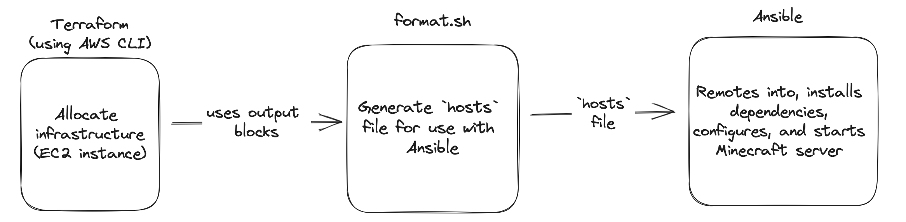

# Automated Minecraft Server Deployment

## Background
Deploying a minecraft server requires lots of configuration and the commands we need to run and interfaces we need to interact with can be cumbersome and tedious to do manually. Because of this, we will make use of Terraform and Ansible to allocate infrastructure and configure a minecraft server automatically.

## Requirements
In order to run the pipeline, you will need to have the following installed, as well as their dependencies (e.g. Python for Ansible)
- [Terraform](https://registry.terraform.io)
- [Ansible](https://ansible.readthedocs.io/en/latest/)
- [AWS CLI](https://aws.amazon.com/cli/)

You will need to rename the `.credentials_template` to `.credentials` and fill in with your AWS access key, secret key, and session token.

## Process Diagram

## Deployment
To deploy the Minecraft Server, run the following
1. `$ ssh-keygen -f minecraft`
   1. follow the prompts for creating a key pair, taking care to select no passphrase
2. `$ terraform init`
3. `$ terraform fmt`
4. `$ terraform apply`
5. `$ chmod +x format.sh`
6. `$ ./format.sh`
7. `$ ansible-playbook playbooks/install_minecraft.yaml -i hosts`
8. `$ terraform output server_ip`

You can now connect to the Minecraft server using the IP and port that were output.